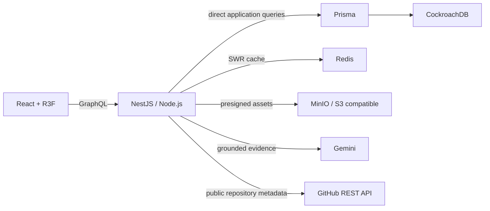

# Architecture

CockroachDB is the source of truth. Redis is disposable and API availability does not depend on a successful cache write. The browser never proxies asset bytes through NestJS. The WebGL layer contains no essential text and can be removed without losing functionality.

The `portfolioData` aggregate returns profile, grouped skills, experience with ordered highlights, translated case studies and social links in one read path. Static hosting uses a versioned in-repository snapshot only when the API cannot be reached and labels that state as stale; it is not presented as live database data.

The profile assistant ranks compact evidence from the portfolio aggregate before invoking Gemini. Provider failure returns a cited extractive answer instead of making the profile unavailable. The API remains one deployable service. Optional vector search and synthetic probing are intentionally deferred until their production contracts and operational value are implemented; they are not placeholder services.

The `githubActivity` read path fetches public repository metadata through a bounded GitHub adapter,
stores successful observations as append-only CockroachDB snapshots and serves Redis-cached data
with an explicit `stale` flag when the provider fails. A BullMQ repeat worker can refresh the same
service when `ENABLE_WORKERS=true`; worker startup and runtime failures do not take down public reads.
