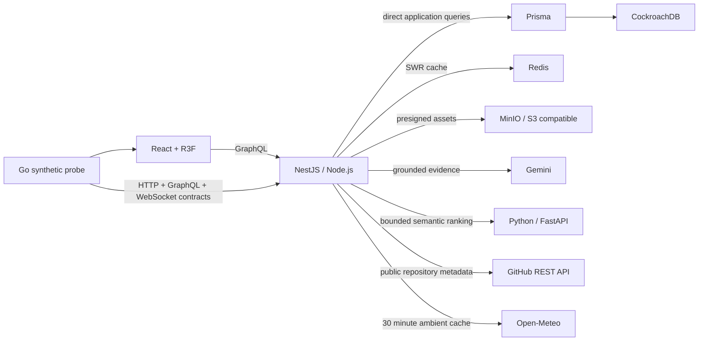

# Architecture

CockroachDB is the source of truth. Redis is disposable and API availability does not depend on a successful cache write. The browser never proxies asset bytes through NestJS. The WebGL layer contains no essential text and can be removed without losing functionality.

The `portfolioData` aggregate returns profile, grouped skills, experience with ordered highlights, translated case studies and social links in one read path. Static hosting uses a versioned in-repository snapshot only when the API cannot be reached and labels that state as stale; it is not presented as live database data.

The profile assistant ranks compact evidence from the portfolio aggregate before invoking Gemini.
The optional Python service performs deterministic Unicode-aware TF-IDF ranking behind a bounded
HTTP contract; timeout, malformed output, or service absence falls back to the local TypeScript
ranker. Provider failure returns a cited extractive answer instead of making the profile unavailable.

The dependency-free Go probe continuously checks the public document, API readiness, GraphQL
portfolio contract, and `graphql-transport-ws` upgrade. It exports bounded Prometheus metrics and
is deliberately outside the request path, so probe failure cannot affect site readiness.

The `githubActivity` read path fetches public repository metadata through a bounded GitHub adapter,
stores successful observations as append-only CockroachDB snapshots and serves Redis-cached data
with an explicit `stale` flag when the provider fails. A BullMQ repeat worker can refresh the same
service when `ENABLE_WORKERS=true`; worker startup and runtime failures do not take down public reads.

The management write path is disabled unless `ENABLE_MUTATIONS=true`. Profile updates use the
client's `expectedVersion` in the database predicate, increment the version atomically, replace
related social links inside the same transaction and invalidate both localized portfolio caches
only after commit. Concurrent stale writers receive a named conflict instead of overwriting data.

Asset uploads are short-lived presigned PUT requests bound to an explicit MIME type and SHA-256.
Confirmation reads S3 metadata and moves the database record from `PENDING` to `READY` only when
the type, checksum and configured size limit match. Invalid objects move to `FAILED`; repeated
confirmation of an already-ready asset is idempotent.

Quality metrics are never synthesized in the browser. CI imports a run tied to a deployment SHA;
CockroachDB stores the measured test, coverage, Lighthouse, bundle and vulnerability values, and
`latestQualityRun` exposes only the newest persisted observation.

Public system events are persisted in CockroachDB before publication. GraphQL subscriptions use
the `graphql-ws` protocol and Redis pub/sub fanout so multiple API instances observe the same feed;
the bounded `systemEvents` query remains available when live fanout is interrupted.

Every HTTP request emits structured Pino output with credential headers redacted. The `/metrics`
endpoint exports measured request, 5xx and duration counters with bounded route labels; liveness
and readiness remain separate operational signals.

The API is auto-instrumented with OpenTelemetry and exports OTLP traces to the local collector. The
collector also scrapes API and synthetic-probe Prometheus metrics; Prometheus persists the bounded
series. Grafana provisions both the Prometheus datasource and the immutable `Portfolio Runtime`
dashboard for request rate, 5xx ratio, duration, and exported spans. Prisma emits structured
`database.slow_query` warnings above `DB_SLOW_QUERY_MS` without logging query parameters. Missing
telemetry infrastructure never changes API readiness.

The browser samples LCP, INP, CLS, and TTFB at 10% without storing a visitor identifier. A bounded
REST endpoint persists only metric, value, rating, navigation type, and timestamp. Engineering mode
shows measured frame time, FPS, draw calls, DPR, GraphQL resource timing, safe Server-Timing, and
available Web Vitals. Ambient Saint Petersburg weather is cached for 30 minutes and disappears on
provider failure rather than becoming a page dependency.
